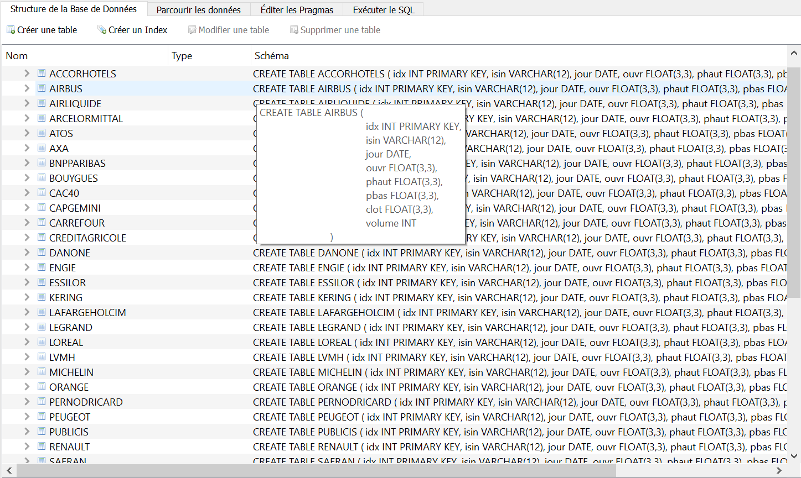
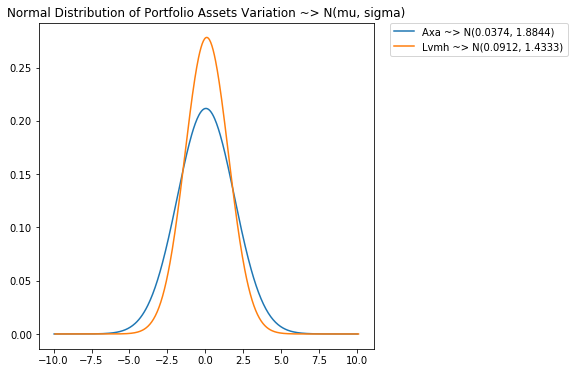
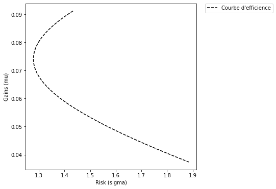
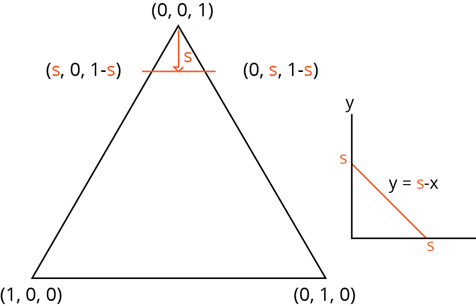
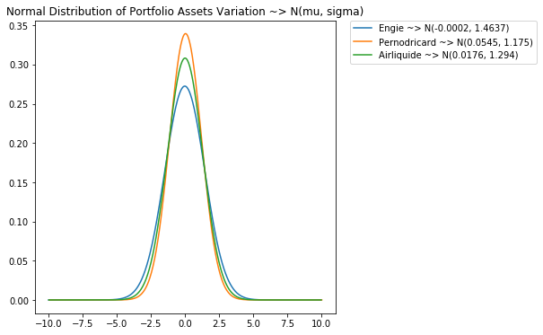
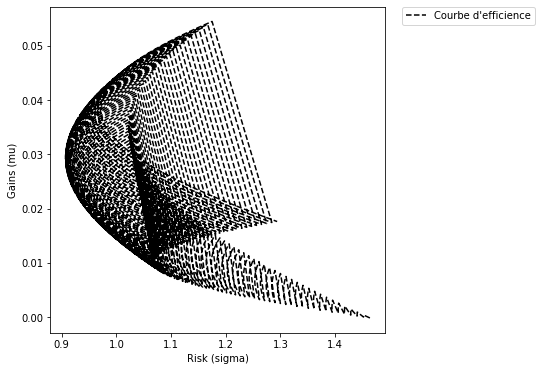
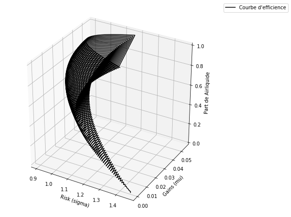

```python
import sys, os
sys.path.append(os.getcwd()+"/projet")
```

# La Théorie Moderne du Portefeuille De Markowitz
## Léo Duret & Adrien Chaillout-Morlot

### Markowitz
C'est un économiste américain auteur du modèle de « diversification efficiente » des portefeuilles d'actifs financiers. 
Ses Recherches sont récompensé en 1990 par un prix Nobel en Sciences Economiques.


### Hypothèses 
- Rationalité des agents
- Aversion aux risques


### Rendement/Risque

On calcule la variation entre les deux valeurs de fermeture en t

\begin{align}
    V_t = \ln(X_t) - \ln(X_{t-1})
\end{align}


Le rendement est l'ésperance de variations (+/-) d'un actif

\begin{align}
    \overline{R_{titre}} = E(R_{titre} )=\frac{1}{N}\sum\nolimits_{i=0}^{N}R_i   
\end{align}

Le risque que est l'écart-type (volatilité) des variations (+/-) d'un actif

\begin{align}
    \sigma_{titre}=\sqrt{\frac{\mathrm{\sum\nolimits_{i=0}^{N}(R_i-\overline{R_{titre}})^2} }{\mathrm{(N-1)} }   }
\end{align}

# Données
## Traitement et exploitation

### Base de données
Nous avions à notre disposition des fichiers Excel d'actifs du CAC 40.

L'interval est 20/10/2015 - 19/10/2017 pour 515 entrées par tableau, entrées ayant toutes leurs valeurs.

##### Ex: Airliquide


| ISIN         | JOUR       | OUVR     | PHAUT    | PBAS     | CLOT     | VOLUME  |
|--------------|------------|----------|----------|----------|----------|---------|
| FR0000120073 | 20/10/2015 | 100      | 100.1818 | 98.4546  | 99.0909  | 833851  |
| FR0000120073 | 21/10/2015 | 99.6364  | 100.0455 | 98.3636  | 99.6818  | 714208  |
| FR0000120073 | 22/10/2015 | 99.5     | 103.4546 | 99.1818  | 103.0455 | 1264656 |
| FR0000120073 | 23/10/2015 | 104.0454 | 105.9546 | 103.6818 | 105.3636 | 1224405 |


## Transformation



### Statistiques de Portefeuille
Calcul de la covariance

\begin{align}
    cov(R_A,R_B)= E(R_A \cdot R_B ) - E(R_A)\cdot E(R_B)
\end{align}

\begin{align} 
    \varphi_{AB}= \frac{\mathrm{cov( R_A \cdot R_B )} }{\mathrm{  \sigma_A \sigma_B } }
\end{align}

Calcul de la matrice de covariance pour 3 titres

\begin{pmatrix}
    Var(R_A)&Cov(R_A, R_B)&Cov(R_A, R_C)\\
    Cov(R_B, R_A)&Var(R_B)&Cov(R_B, R_C)\\
    Cov(R_C, R_A)&Cov(R_C, R_B)&Var(R_C)
\end{pmatrix} 

Idem pour la matrice de corrélation


```python
#Exemple
from markowitz import Asset, Portfolio

t1 = Asset("renault")
t2 = Asset("peugeot")

p = Portfolio(t1, t2)

p.stats()

```


<div>
<style scoped>
    .dataframe tbody tr th:only-of-type {
        vertical-align: middle;
    }

    .dataframe tbody tr th {
        vertical-align: top;
    }

    .dataframe thead th {
        text-align: right;
    }
</style>
<table border="1" class="dataframe">
  <thead>
    <tr style="text-align: right;">
      <th></th>
      <th>renault</th>
      <th>peugeot</th>
    </tr>
  </thead>
  <tbody>
    <tr>
      <th>len</th>
      <td>515</td>
      <td>515</td>
    </tr>
    <tr>
      <th>avg</th>
      <td>0.00035596</td>
      <td>0.000786689</td>
    </tr>
    <tr>
      <th>stdv</th>
      <td>0.0197384</td>
      <td>0.0212004</td>
    </tr>
    <tr>
      <th>COVAR</th>
      <td></td>
      <td></td>
    </tr>
    <tr>
      <th>renault</th>
      <td>0.000389606</td>
      <td>0.00033382</td>
    </tr>
    <tr>
      <th>peugeot</th>
      <td>0.00033382</td>
      <td>0.000449456</td>
    </tr>
    <tr>
      <th>CORR</th>
      <td></td>
      <td></td>
    </tr>
    <tr>
      <th>renault</th>
      <td>1</td>
      <td>0.797731</td>
    </tr>
    <tr>
      <th>peugeot</th>
      <td>0.797731</td>
      <td>1</td>
    </tr>
  </tbody>
</table>
</div>


# Efficacité des portefeuilles à 2 titres
## Théorie et Application

### Théorie

Soit deux titres A et B et x la part de titre A tel que

\begin{align}
    0 \leq x \leq 1
\end{align}


On donne le rendement du portefeuille en fonction de x

\begin{align}
    R_P(x)     = x \cdot R_A + (1-x) \cdot R_B
\end{align}


Et sa variance


\begin{array}{lcl}
    Var(R_P) &=& (x \cdot \sigma_A + (1-x) \cdot \sigma_B)^2 \\
    &=& x^2 \cdot Var(R_A) + (1-x)^2 \cdot Var(R_B) + 2 \cdot x \cdot (1-x) \cdot Cov(R_A, R_B)
\end{array}


### La Frontière Efficiente

Il s'agit de l'ensemble des combinaisons optimales d'actifs pour une distribution donnée.

On donne son plan par le systeme suivant:


\begin{cases} 
    R_P(x)     = x \cdot R_A + (1-x) \cdot R_B \\
    \sigma_P(x)= \sqrt{Var(R_P)}
\end{cases}


```python
%matplotlib inline
```


```python
from markowitz import Asset, Portfolio
from plots import Graphics

t1 = Asset("axa")
t2 = Asset("lvmh")

g = Graphics(t1, t2)

# affichons les lois normales
g.add_norm("axa")
g.add_norm("lvmh")

g.show()
```





```python
# La frontière efficiente

g.add_ef("axa", "lvmh")
g.show()
```





# Extension à N titres
## Théorie et application

### Généralisation des équations
Généralisation des l’équation avec $ \alpha $ distribué entre les titres tel que $\sum\alpha_i=1$

#### L'ésperance
\begin{align}
    E(R_p) = \sum_{i=0}^{n}\alpha_i \cdot E(R_i)
\end{align}


##### La variance

\begin{align}
    Var(R_P) = (\sum_{i=0}^{n}\alpha_i \cdot \sigma_i)^2
\end{align}

C'est une forme quadratique d'ordre N donc il existe une matrice symétrique $ N \cdot N $ associée 
Pour 3 titres on trouve

\begin{pmatrix}
     \alpha^2_{1}& \frac{\mathrm{\alpha_1\alpha_2} }{\mathrm{2}} &\frac{\mathrm{\alpha_1\alpha_3} }{\mathrm{2}}\\
    \frac{\mathrm{\alpha_1\alpha_2} }{\mathrm{2}}&\alpha^2_2&\frac{\mathrm{\alpha_2\alpha_3} }{\mathrm{2}}\\
    \frac{\mathrm{\alpha_1\alpha_3} }{\mathrm{2}}&\frac{\mathrm{\alpha_2\alpha_3} }{\mathrm{2}}&\alpha^2_{3}
\end{pmatrix} 


### Calcul de l'écart-type
\begin{align}
    A = M_{quadratique} \cdot M_{covar}\\
\end{align}

La trace de A est la somme des variances pondérés par les $\alpha_i$ soit la variance de $R_p$

\begin{align}
    trace(A)= Var(R_P)
\end{align}

\begin{align}
    \sigma_{R_P} = \sqrt{Var(R_P)} = \sqrt{trace(A)}
\end{align}

### Génération du plan barycentrique
$ E = 
\begin{Bmatrix}
     (x, y, z)  \in  \mathbb{R^3}\setminus x + y + z = 1
\end{Bmatrix} 
$





```python
# Cas pratique pour un portefeuille à 3 titres
from markowitz import Asset, Portfolio
from plots import Graphics
titres = [
    Asset("engie"),
    Asset("pernodricard"),
    Asset("airliquide")
]
g = Graphics(*titres)

g.add_norm("engie")
g.add_norm("pernodricard")
g.add_norm("airliquide")
g.show()
```





```python

g.add_ef("airliquide", "pernodricard", "engie")
g.show()
```





```python
g.add_ef("airliquide", "pernodricard", "engie", threeD=True)
g.show()
```





# Conclusion
## Critiques et application

### Critiques

- Théorie remise en cause notamment par Benoit Mandelbrot car ce modèle serait trop déconnecté des marchés financiers. En effet la loi de gauss sous évalue la probabilité d'évenements improbables (notamment les krachs boursiers).

- Les suppositions néo-classiques sont irréalistes, les individus ne sont pas rationnels et les variations passé ne se répètent pas dans le futur

### Ouverture

Afin de mieux anticiper les évenements improbables on peut utiliser la loi de pareto ou les lois de puissance.
    

# Merci

### Le code ainsi que la présentation sont disponibles sur 
[github.com/hyyking/tmp](github.com/hyyking/tmp)
